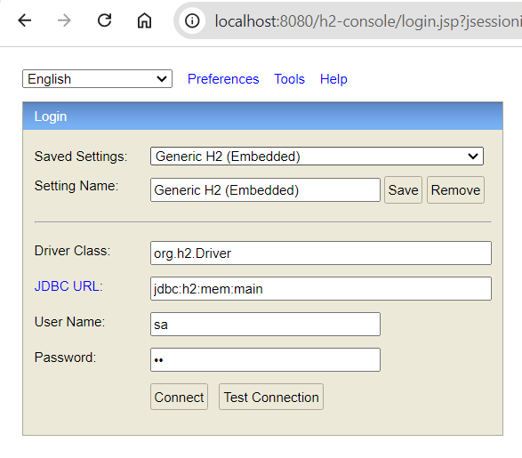
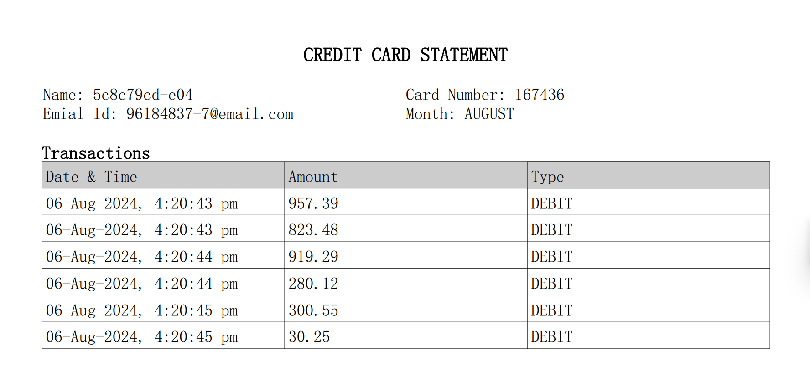

## SchedulerApp
 Job scheduling service that can streamline credit card statement generation.

[Download kafka](https://downloads.apache.org/kafka/3.7.1/kafka_2.12-3.7.1.tgz) and extract it.

Run Kafka By using CLI Commands
- Step 1. Run Zookeeper Server
```
$ bin/zookeeper-server-start.sh config/zookeeper.properties
```
```
on windows:
kafka-3.7.1>bin\windows\zookeeper-server-start.bat .\config\zookeeper.properties
```
- Step 2. Run Kafka Server
```
$ bin/kafka-server-start.sh config/server.properties
```
```
on windows:
kafka-3.7.1>bin\windows\kafka-server-start.bat .\config\server.properties
```
- Step 3. Run the producer server. In this app, a scheduler will fetch the transaction details of users whose statements are to be generated today and send them to the Kafka server for further processing.
```
producer>mvn spring-boot:run
```
- Step 4. Run the consumer server. Receives the transaction details of users from the Kafka server and generates the card statement document for each user.
```
consumer>mvn spring-boot:run
```

### Demo
```
Insert 5 users: http://localhost:8080/insertUsers/5
Check users in h2 database: http://localhost:8080/h2-console
password=sa
```
 
```
Add transaction for each user: http://localhost:8080/doTransaction?userId=10001
```
```
Send : http://localhost:8080/sendCardStatementRequestToKafka
```
Check the generated documents at location
```
consumer\credit-card-statements
```
Generated Card Statement image: 

